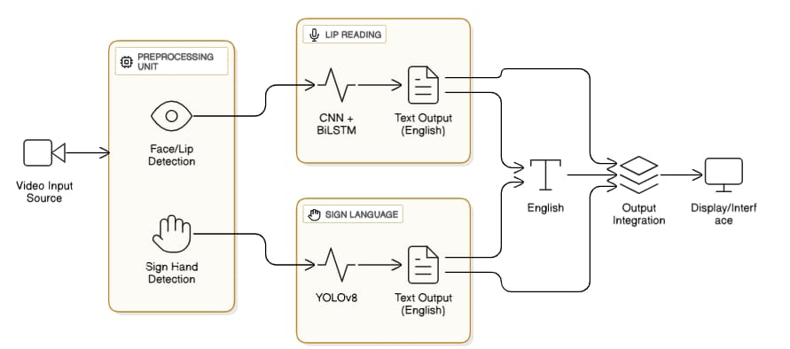

# Talkify AI: Multimodal AI Communication Assistant

[](#)
[](#)
[](#)

Talkify AI is an advanced, real-time communication bridge designed for the hearing and speech impaired community. By leveraging cutting-edge computer vision and deep learning, it translates lip movements and sign language gestures into readable text instantly.

## 🌟 Key Features

- **Lip Reading (Dual Language)**: Real-time recognition of lip movements in both **Bengali** and **English**.
- **Sign Language Recognition**: High-accuracy translation of ASL gestures using YOLOv8 and MediaPipe.
- **Hybrid AI Engine**: Combines MediaPipe keypoint extraction with CNN-LSTM temporal processing.
- **Real-time Performance**: Optimized for low-latency feedback (<500ms).
- **Professional UI**: Clean, accessible interface with visual guidance toggles.

## 🏗️ System Architecture

 
*(See [SRS.md](docs/SRS.md) for detailed diagram)*

## 👥 Project Team

- **Rayyan**: Backend Development & Integration
- **Ardra**: UI/UX Design & Frontend Implementation
- **Angel**: API Design & Frontend Communication
- **Nithya**: AI Models (Lip Reading & Sign Recognition)

## 📂 Documentation

- [**SRS.md**](docs/SRS.md): Software Requirement Specifications
- [**TEAM.md**](docs/TEAM.md): Team Roles and Responsibilities
- [**PLAN.md**](docs/PLAN.md): Project Roadmap and Tasks
- [**TRAINING_GUIDE.md**](TRAINING_GUIDE.md): Instruction for dataset training

## 🚀 Getting Started

### Prerequisites
- Python 3.10+
- Node.js 18+
- Webcam

### Installation
1. **Clone the Repo**
   ```bash
   git clone https://github.com/rayyananas0369/Talkify-AI.git
   cd Talkify-AI
   ```

2. **Backend Setup**
   ```bash
   pip install -r backend/requirements.txt
   python backend/main.py
   ```

3. **Frontend Setup**
   ```bash
   cd frontend
   npm install
   npm run dev
   ```

---
*Empowering individuals through AI. Talkify AI © 2026.*
